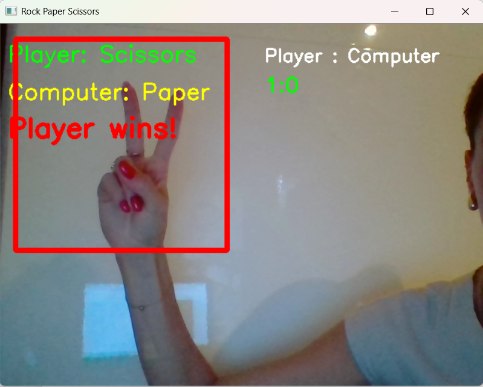

# rock_paper_scissors 

A real-time Rock-Paper-Scissors game using hand gesture recognition with OpenCV. Play against the computer using your webcam!

---

## Screenshot



---

## How to Run

Run the following commands in your terminal:

```bash
# Clone the repository
git clone https://github.com/petra126/rock_paper_scissors.git
cd rock_paper_scissors

# Install dependencies
pip install -r requirements.txt

# Launch the notebook
jupyter notebook rock_paper_scissors.ipynb
```
---

## Controls

- ESC → Exit the game 
- Rock → Closed fist
- Scissors → Two fingers raised
- Paper → All five fingers open 

---

## Tips for Best Results

- Use the game in front of a plain background (ideally a white wall) to improve hand detection. 
- Keep your laptop steady during the background calibration phase (when the text `WAIT: GETTING BACKGROUND` is shown).
- Do not place your hand inside the red ROI (red) box until the calibration is finished, otherwise the background will not be captured correctly. 
- Hold your hand straight towards the camera so the fingers can be recognized more accurately.
  
---


## How it Works

- The game detects your hand using OpenCV.
- Counts fingers to determine Rock (0), Paper (5), or Scissors (2).
- Plays against a random computer choice and updates the score.

---

## Technologies Used

- Python 3
- OpenCV
- NumPy
- scikit-learn
- Jupyter Notebook

---

