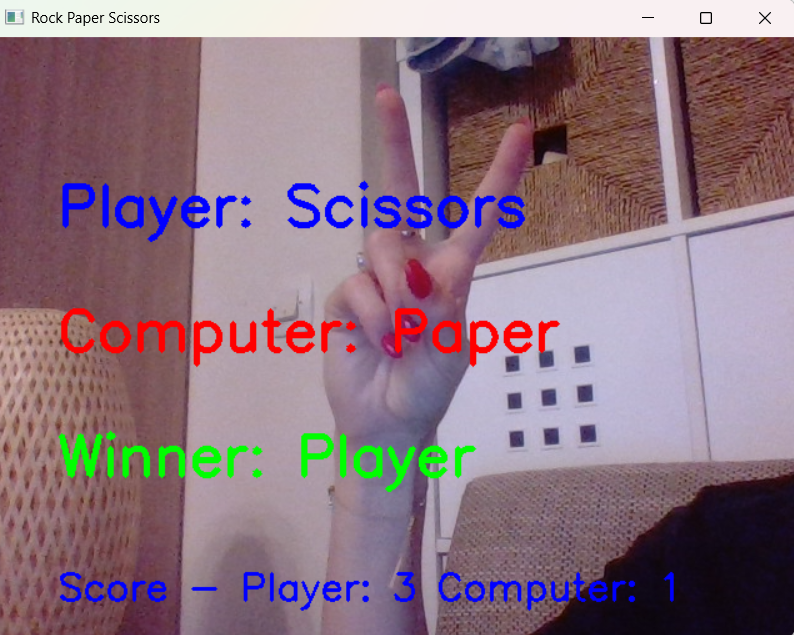

# rock_paper_scissors 

A real-time Rock-Paper-Scissors game that uses hand gesture recognition via your webcam.

---

## Screenshot



---

## How to Run

Run the following commands in your terminal:

```bash
# Clone the repository
git clone https://github.com/petra126/rock_paper_scissors.git
cd rock_paper_scissors

# Install dependencies
pip install -r requirements.txt

# Launch the notebook
jupyter notebook rock_paper_scissors.ipynb
```
---

## Controls

- ESC → Exit the game 
- Rock → Closed fist
- Scissors → Two fingers raised
- Paper → All five fingers open 

---

## Technologies Used

- Python 3
- OpenCV
- MediaPipe
- NumPy
- Jupyter Notebook

---

